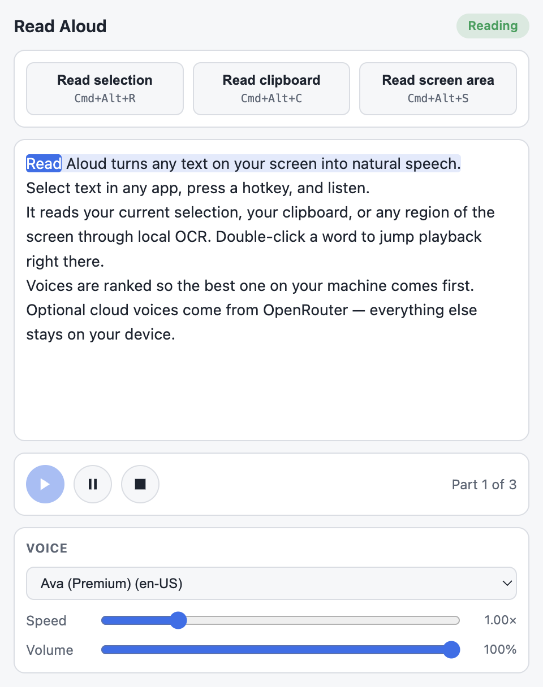

# Read Aloud

Listen to anything on your screen — with natural voices, live word highlighting, and playback you actually control.

Two tools in one repo:

- **A browser extension** for listening to web pages, selections, or pasted text — with local neural [Kokoro](https://github.com/hexgrad/kokoro) voices that run entirely in your browser.
- **A desktop app** (`desktop/`) that reads text from **any** application on Windows and macOS: your selection, your clipboard, or any region of the screen via local OCR.

<p align="center">
  
</p>

Built out of a simple frustration: native text-to-speech is slow, robotic, and reads *everything* — I wanted to point at text anywhere on my screen, hear it in a good voice at my speed, and jump around by double-clicking. Now it exists.

## Features

- Start reading a page, a selection, pasted text, or exactly where you double-click
- Follow along with sentence and word highlighting
- Choose from browser voices, Chrome TTS voices, 28 local Kokoro voices, or 36 Flux cloud voices
- Change speed, pitch, and volume while listening
- Pause, resume, and move between sections
- Keep Kokoro speech local after its one-time model download

Kokoro runs in the browser through WebGPU when the GPU supports it, falling back to WebAssembly. The model is downloaded from Hugging Face the first time you select a Kokoro voice — the popup shows download progress — then stored in the browser cache. Selecting a Kokoro voice also warms the model in the background so playback starts faster.

Flux voices are synthesized by Deepgram Flux through [OpenRouter](https://openrouter.ai)'s free `deepgram/flux-tts:free` endpoint. Select a Flux voice in the popup and paste an OpenRouter API key (create one at [openrouter.ai/keys](https://openrouter.ai/keys)) — the key is stored in `chrome.storage.local` and never syncs off the device. Free-tier requests are rate limited by OpenRouter.

## Voices at a glance

| Voice type | Where it runs | Cost | Notes |
|---|---|---|---|
| System voices | On your device | Free | macOS Premium/Enhanced voices (e.g. Ava) rank first automatically |
| Kokoro (28 voices) | On your device (browser extension) | Free | Neural TTS via WebGPU/WASM, one-time model download |
| Flux via OpenRouter (36 voices) | Cloud | Free tier | Bring your own [OpenRouter](https://openrouter.ai) key, opt-in |

## Install locally

1. Install [Node.js](https://nodejs.org/).
2. Run:

   ```bash
   npm install
   npm run build
   ```

3. Open your browser's extensions page.
4. Enable **Developer mode**.
5. Choose **Load unpacked** and select this project folder.

The extension manifest loads the compiled files from `dist/`.

## Development

```bash
npm run typecheck
npm run build
npm run watch
```

Integration tests for the OpenRouter engine run against a live browser via CDP:

```bash
node .tools/test-openrouter.mjs 9232 [optional-real-api-key]
```

## Desktop app

`desktop/` contains an Electron app that reads text from anywhere on screen, not just the browser. It reuses the extension's chunker and speech engines (system voices + Flux cloud voices).

- **Ctrl/Cmd+Alt+R** — read the text currently selected in any app (simulated copy; the previous clipboard text is restored)
- **Ctrl/Cmd+Alt+C** — read the clipboard
- **Ctrl/Cmd+Alt+S** — drag a rectangle anywhere on screen; the text inside is OCR'd (Tesseract, local) and read aloud
- **Ctrl/Cmd+Alt+X** — stop

The app lives in the tray; the player window shows the captured text with live chunk/word highlighting.

```bash
cd desktop
npm install
npm start          # build + run
npm run smoke      # headless end-to-end playback test
npm run package    # build installers via electron-builder
npm run package:mac # macOS build, output outside the project tree
```

On macOS the selection hotkey needs the Accessibility permission (System Settings → Privacy & Security) the first time, and screen capture needs the Screen Recording permission. The English OCR model (~2 MB) downloads on first use and is cached in the app's user-data directory.

### macOS packaging notes

Without a "Developer ID Application" certificate electron-builder skips signing, which leaves the bundle carrying the raw linker-signed Electron binary — resources unsealed and the identifier still `Electron`. macOS then has no stable identity to attach TCC grants to, so Accessibility and Screen Recording cannot be granted reliably. The `afterPack` hook (`desktop/build/after-pack.cjs`) ad-hoc signs the bundle under its real bundle id to fix that, and steps aside when a real certificate is configured.

An ad-hoc identity is the bundle's cdhash, so **every rebuild is a new identity**: macOS forgets the granted permissions and they must be re-approved. Remove the stale "Read Aloud" entries in System Settings before re-adding the new build.

Use `npm run package:mac` when the checkout lives in a cloud-synced folder (iCloud Drive, Dropbox, OneDrive). Those re-stamp `com.apple.FinderInfo` onto the bundle while it is being built, and `codesign` refuses to sign it (`resource fork, Finder information, or similar detritus not allowed`). That script writes the build to `$TMPDIR` instead, out of the sync provider's reach.

## Privacy

Read Aloud does not require an account. Browser voices use the speech engines available on your system. Kokoro synthesis runs locally in the extension after its model files have been downloaded and cached. Flux voices send the text being read to OpenRouter for synthesis — they are opt-in and never auto-selected. The desktop app's OCR runs entirely locally.

## License

[MIT](LICENSE) — use it, fork it, ship it.
